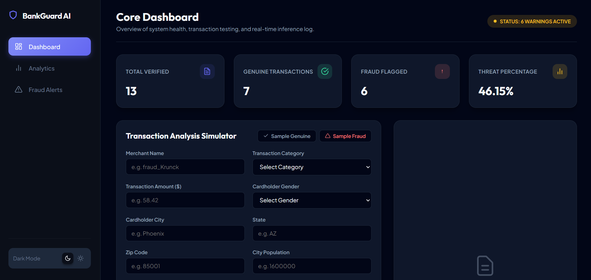
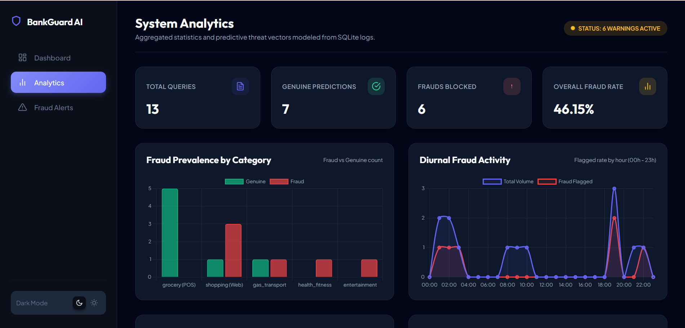
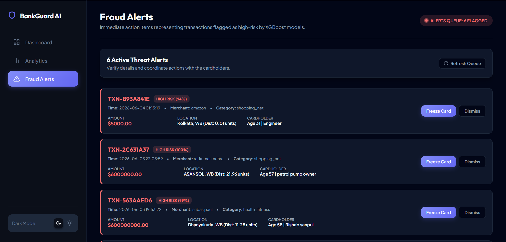

# AI-Powered Credit & Debit Card Fraud Detection System

## Overview
This project detects fraudulent credit and debit card transactions using Machine Learning.

The system includes:
- Data Preprocessing
- Fraud Detection Model
- Flask Backend API
- Analytics Dashboard
- Fraud Alert System

## Features
- Fraud Detection using Machine Learning
- Real-Time Risk Prediction
- Fraud Alerts
- Analytics Dashboard
- SQLite Database Integration
- Flask Backend API

## Tech Stack
- Python
- Flask
- Scikit-Learn
- SQLite
- HTML
- CSS
- JavaScript
- Docker

## Dataset
Sparkov Credit Card Fraud Dataset

Files:
- fraudTrain.csv
- fraudTest.csv

## Project Structure

backend/
frontend/
notebooks/
tests/

## Future Improvements
- Real-Time Monitoring
- SHAP Explainable AI
- SMS & Email Alerts
- Advanced Analytics Dashboard

## Screenshots

### Dashboard

### Analytics

### Fraud Alerts
